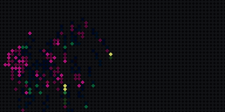
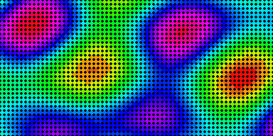
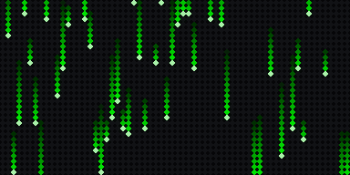
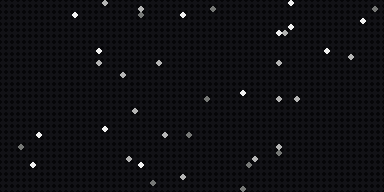
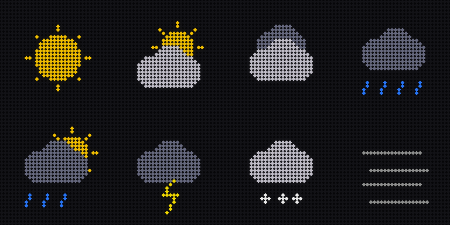
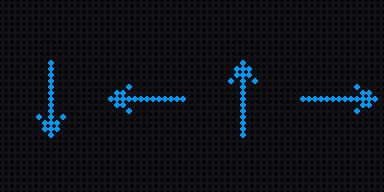
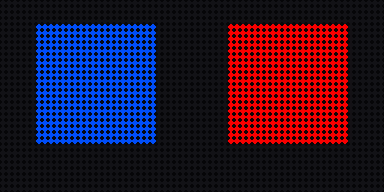
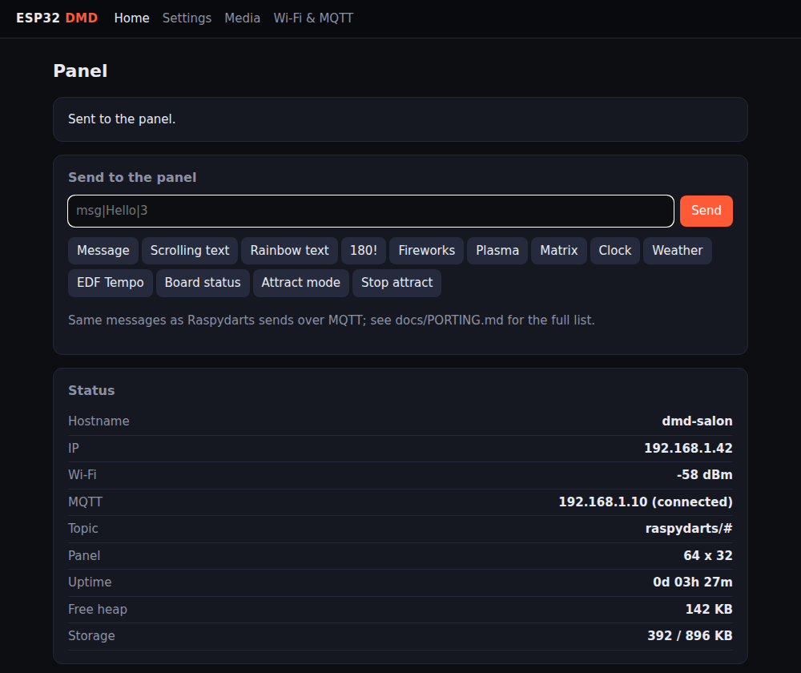
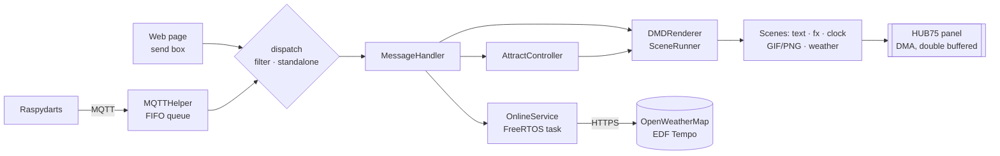

# ESP32 DMD

[](https://github.com/antoine-voiry/ESP32_DMD/actions/workflows/build.yml)


**A dart board scoreboard on one ESP32.** This firmware drives a HUB75 RGB LED panel from
Raspydarts over MQTT. It is a full port of **Raspy2DMD**, the Raspberry Pi DMD
renderer. It accepts the same messages and settings, with no Pi needed.

<p align="center">
  
  
  <br>
  
  
</p>

<sub>These previews are rendered by the firmware's own drawing code (see <a href="#previews">Previews</a>), not mock-ups.</sub>

## Features

| | |
|---|---|
| 🎯 **Scores and special moves** | Scores, and all the special moves (maximum 180, hat trick, three in a bed, breakfast…), each with its GIF or animation |
| 🔤 **Text** | 8 movements (scrolls, rotate, flip, twirl…), colours, automatic font fitting, holds that can't be interrupted |
| 🎞️ **Media** | Animated GIFs and PNG images on LittleFS, centred or stretched, effects from `effets.txt`, exclusions |
| 🕰️ **Clock** | NTP time in any time zone with French date names, a pattern background, and brightness per hour |
| 🌦️ **Online** | OpenWeatherMap weather and forecast with drawn icons and a wind arrow; EDF Tempo days; geocoding |
| 🎠 **Attract mode** | Idle playlist (`12T4MPESF`): clock, text carousel, weather, Tempo, board status, effects |
| ✨ **ESP32 extras** | `fx` animations (fireworks, plasma, stars, matrix) and `msgfx` text effects (rainbow, wave, typewriter, sparkle) |
| ⚙️ **Settings** | Every `Raspy2DMD.cfg` key; `conf`, `rldconf` and `receipconf` work as on the Pi; standalone mode |
| 🌐 **Web interface** | Dashboard with a send box and one-click presets, a settings editor, and a media manager |

<p align="center">
  <br>
  
  
</p>

## Quick start

1. **Wire the panel.** Use an ESP32 dev board (4 MB flash) and a 64×32 HUB75 panel. The pins are:

   | R1 | G1 | B1 | R2 | G2 | B2 | A | B | C | D | CLK | LAT | OE |
   |---|---|---|---|---|---|---|---|---|---|---|---|---|
   | 25 | 26 | 27 | 21 | 22 | 23 | 12 | 16 | 17 | 18 | 15 | 32 | 33 |

   Other sizes are set with `DMDRenderer.cols`, `rows` and `led_chain`. A 64-row panel also needs `-DE_PIN=<gpio>`.

2. **Flash it.**

   ```bash
   pio run -t upload && pio device monitor
   ```

3. **Connect it.** Join the `DMD_CONFIG_WIFI` access point, then enter your Wi-Fi network, the MQTT broker
   (usually `raspydarts.local`), the topic and a hostname.

4. **Play.** Raspydarts now drives the panel. To try it by hand:

   ```bash
   mosquitto_pub -h raspydarts.local -t raspydarts/dmd -m 'msg|Hello darts!|3'
   mosquitto_pub -h raspydarts.local -t raspydarts/dmd -m 'fx|fireworks|10'
   ```

   You can also open `http://<board-ip>/` (shown on the panel at start-up), type a command, or pick a preset.

## Web interface

<p align="center"></p>

| Page | What it does |
|---|---|
| `/` | Board status (IP, Wi-Fi, MQTT, uptime, memory, storage), a send box and presets |
| `/settings` | Every Raspy2DMD setting, grouped by section. Settings with no effect on the ESP32 are greyed out |
| `/files` | Upload, browse and delete GIFs, images, carousel texts and `effets.txt` (about 900 KB of LittleFS) |
| `/config` | Wi-Fi portal values: MQTT broker, topic, hostname |

## How it works



- **Non-blocking:** every animation is a `Scene` that `loop()` advances a frame at a time. MQTT, the web
  server and new messages are never stalled, and a new message interrupts the current scene, as on the Pi.
- **Board-independent core:** protocol parsing, layout, motions, effects, clock, media rules, weather
  formatting and the settings schema live in `src/core` without Arduino headers. They are unit tested on a PC.
- **Network off the render path:** HTTPS requests run on their own FreeRTOS task and are cached like the
  Pi's token files.

| Folder | What |
|---|---|
| `src/core` | Board-independent logic, unit tested on the host |
| `src/net` | ArduinoJson parsers for OpenWeatherMap and EDF Tempo |
| `src/render` | Scenes drawn on the panel |
| `src/util` | Firmware services: MQTT, Wi-Fi, web server, settings, storage, attract mode, NTP |
| `src/matrix` | HUB75 DMA driver wrapper |
| `test/host` | Host unit tests |
| `tools/preview` | Renders the README previews |

## Tests

```bash
make -C test/host                                      # core tests (ASan + UBSan) and a C++11 compile check
make -C test/host json ARDUINOJSON=<ArduinoJson>/src   # JSON parser tests
```

CI runs both, then builds the firmware, on every push and pull request.

## Previews

The images above come from the same `src/core` code that runs on the board, drawn as LEDs:

```bash
make -C tools/preview   # needs g++ and Python 3 with Pillow
```

## Documentation

[docs/PORTING.md](docs/PORTING.md) has the full command table, the media layout, the online services, every
setting, standalone mode, and each difference from the Pi version, including the original bugs that were fixed.
